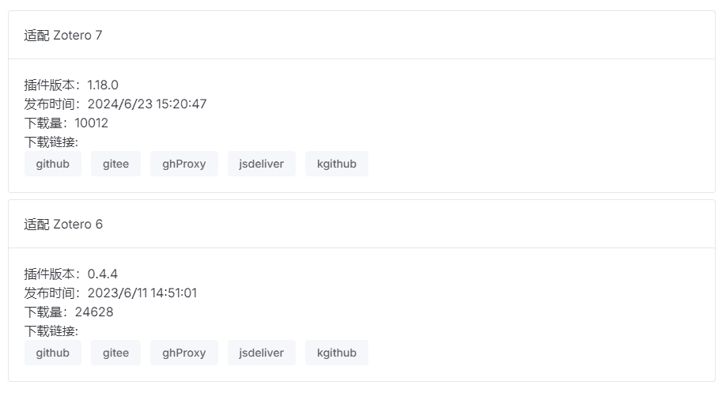

# 插件安装的常见问题

关于插件的安装方法与常用插件介绍，请参见 [插件与功能扩展](../plugins/about-plugin.md)。

## 无法打开插件页面

**如果你能看到 `插件 / Plugins` 选项，点击这一按钮的时候却没反应：** 请先完全退出 Zotero（Windows 用户关闭窗口后可能需要再任务管理器中结束 Zotero 相关的进程，macOS 用户建议使用 Command+Q 快捷键完全退出），然后再重新尝试。如果退出重开后依然没有，请重启电脑，然后再尝试。这是 Zotero 的一个 Bug。

## 插件页面显示过大超出屏幕

**如果你能打开窗口，却发现窗口顶部捅破了天际，看不到上面的内容：** 请先把窗口左右方向拉窄，这样顶部就回自己跳出来了；然后再把上下方向拉矮，把窗口调整到合适的位置，一段时间之内应该就会都是正常的了。这大概也是 Zotero 的一个祖传 Bug。如果是 Windows 系统，选中该窗口，使用快捷键 `WIN + 左或右方向键` 调整窗口。

## 插件安装包格式特殊

**如果你下载到的插件安装包格式比较特殊** （如 .zoteroplugin 文件或 .zip 文件），这些文件可能不能在手动安装的文件选择窗口中选中。对于这些特殊格式的安装包，你 **只需要把安装包文件拖至前文中提到的插件列表页即可安装** 。

## 无法安装插件「%S」。他可能无法与该版本的 Zotero 兼容

**如果安装的时候提示** `无法安装插件“%S”。他可能无法与该版本的 Zotero 兼容。`：

1. 请检查下载的插件格式。如果从 GitHub 下载，安装包在右侧的 Release 中的 xpi 文件。请不要下载源码。

2. 请检查插件安装包是否损坏。重新下载一遍。

3. 检查插件适配的 Zotero 版本

   首先需要确定自己 Zotero 的版本，依次点击 「帮助」->「关于 Zotero」，即可看到自己 Zotero 的版本（如图则是 Zotero 6）。

   

   在[国内镜像](https://zotero-chinese.com/plugins/)下载插件时，查看页面中`目标 Zotero 版本`找到适合自己的插件版本，点击后面的下载链接就可以下载到适合自己的插件。

   

## 安装插件后，无任何弹窗错误，但没有插件设置项或菜单项

Zotero 7.0.5 以来的几个版本，在安装插件后，虽然没有任何错误弹窗，但是插件实质上没有安装成功，表现为「应有设置窗口」的插件没有显示「设置项」、「应有菜单项」的插件没有显示「菜单项」等。

可能会由以下方式触发：

- 同时安装多个插件：一次性拖入多个插件的 xpi 安装包进入 Zotero 的插件管理界面；或是在「Install Plugin From File」中同时选择多个插件的 xpi 安装包。
- Zotero 退出时选项卡处于阅读器页面而不是条目列表页面。

如果你遇到这种问题，请尝试：

1. 确保使用的是最新版本的 Zotero 和插件
2. 重启 Zotero
3. 卸载所有插件，重启 Zotero，然后逐个安装（一次只安装一个）这些插件
4. 退出 Zotero 时回到条目列表页面

## 插件检查更新时提示未找到更新

可能是确实没有更新，也可能是无法链接到 GitHub。请在插件商店寻找你需要的安装包：[https://zotero-chinese.com/plugins/](https://zotero-chinese.com/plugins/)
即使你能够打开 GitHub 页面，也并不代表 Zotero 能够顺利下载到插件更新。这取决于网络情况。
